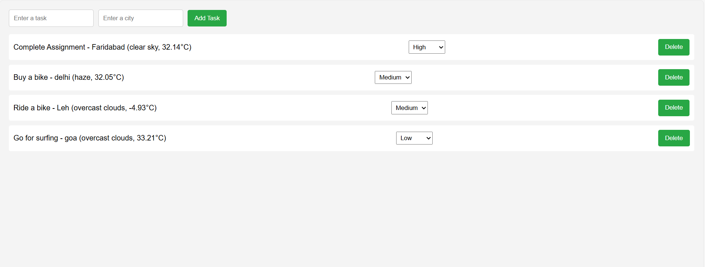

# React To-Do Application with Weather API Integration

This is a **React-based To-Do Application** that allows users to add, delete, and prioritize tasks. It integrates with the **OpenWeatherMap API** to fetch weather data for a specified city and displays it alongside each task. The application uses **Redux** for state management and follows best practices for code organization and scalability.

---

## Features Implemented

1. **Add Tasks**:
   - Users can add tasks with a description and a city name.
   - The application fetches weather data (temperature and weather description) for the specified city.

2. **View Tasks**:
   - Tasks are displayed in a list format.
   - Each task shows:
     - Task description.
     - City name.
     - Weather information (temperature and weather description).

3. **Delete Tasks**:
   - Users can delete tasks by clicking a delete button.

4. **Task Prioritization**:
   - Users can set the priority of each task (High, Medium, Low).
   - Tasks are displayed with their priority level.

5. **User Authentication (Mock)**:
   - A mock login/logout feature is implemented using Redux.
   - The To-Do list is protected behind authentication.

6. **Responsive Design**:
   - The application is fully responsive and works seamlessly on mobile, tablet, and desktop devices.

---

## Screenshots

### 1. Login Page


### 2. To-Do List with Weather Data


### 3. Add Task with City


### 4. Delete Task


---

## Technologies Used

- **Frontend**:
  - React
  - Redux (for state management)
  - React Router (for navigation)
  - Fetch API (for weather data integration)
  - CSS (for styling)

- **Backend**:
  - OpenWeatherMap API (for weather data)

---

## Setup and Running Instructions

### Prerequisites

1. **Node.js**: Ensure you have Node.js installed on your machine. You can download it from [here](https://nodejs.org/).
2. **Git**: Ensure you have Git installed. You can download it from [here](https://git-scm.com/).

### Step 1: Clone the Repository

Clone the repository to your local machine:

```bash
git clone https://github.com/your-username/react-todo-app.git
cd react-todo-app
```

### Step 2: Install Dependencies

### Step 3: Set Up Environment Variables
Create a .env file in the root directory of the project.
Add your OpenWeatherMap API key to the .env file.

### Step 4: Run the Application
Start the development server.
The application will open in your browser at http://localhost:3000
